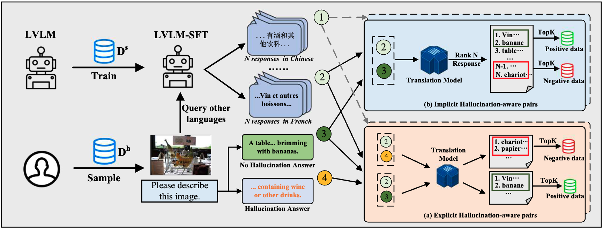
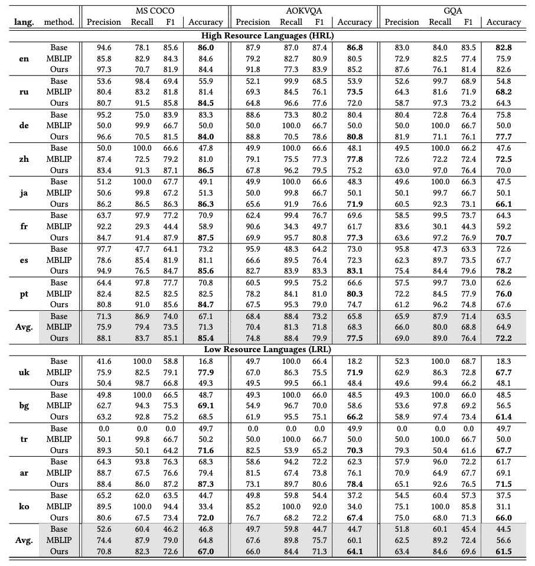
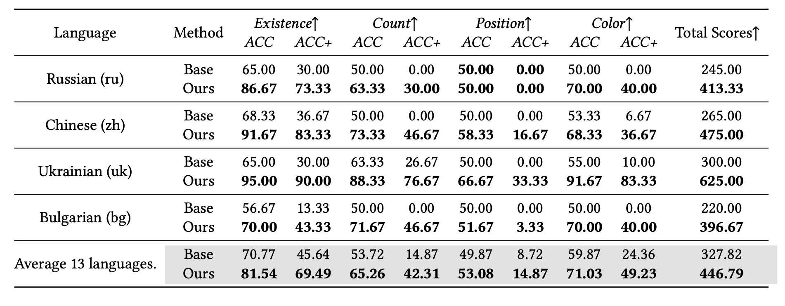
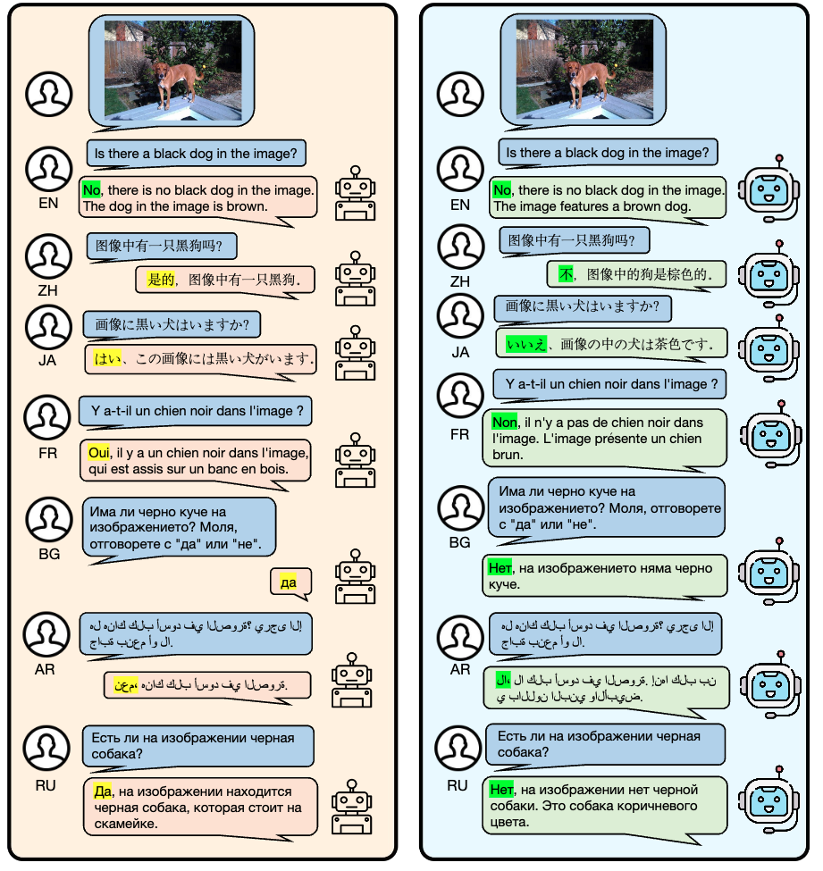

# Mitigating Multilingual Hallucination in Large Vision-Language Models
<!-- This is the official repo for Multilingual Hallucination Removal, a simple but effective method for mitigating multilingual hallucinations in LVLMs. -->
This is the official repository for Multilingual Hallucination Removal (MHR), a straightforward yet notably effective approach aimed at alleviating multilingual hallucinations prevalent in Large Vision-Language Models (LVLMs).
<div style='display:flex; gap: 0.25rem; '>
<a href='LICENCE'></a>
</div>


## 🎯 Overview

<!-- - We probosed Multilingual Hallucination Removal(MHR) a simple but effective hallucination removal framework on different languages. -->
- We proposed the Multilingual Hallucination Removal (MHR) strategy, a straightforward yet profoundly effective framework for eliminating hallucinations across various languages.
<!-- - MHR have 2 stages, namely multilingual supervised fine-tune and multilingual-enhanced preference optimization. During preference optimization, we proposed
3 method to generate alignment data, which is hallucination-enhanced alignment, language-enhanced alignment and translation-enhanced alignment. -->
- Our Multilingual Hllucination Removement (MHR) method comprises two stages, specifically Multilingual Supervised Fine-Tuning and Multilingual-Enhanced Preference Optimization. Within the context of Preference Optimization, we put forward three innovative strategies for generating alignment data. These strategies consist of Hallucination-Enhanced Alignment, Language-Enhanced Alignment, and Translation-Enhanced Alignment.


## 🕹️ Usage
### Environment Setup
```bash
conda create -n mhr python=3.9
conda activate mhr
cd MHR
pip install -r requirements.txt
pip install -e .
```

### Train


1. Multilingual Supervised Fine-tuning:
    - 2.1 Prepare SFT data: [PALO](https://huggingface.co/datasets/MBZUAI/palo_multilingual_dataset)
    - 2.2 Train SFT on LVLM:
        <details>
        <summary>SFT SCRIPTS</summary>
        ```bash
            
            PROMPT_VERSION=v1
            MODEL_VERSION=vicuna-v1-5-7b
            LM_MODEL_CKPT=lmsys/vicuna-7b-v1.5

            deepspeed m3apo/alignment/models/llava_v1_5/train_sft.py \
                --deepspeed ./scripts/zero3.json \
                --model_name_or_path $LM_MODEL_CKPT \
                --version $PROMPT_VERSION \
                --data_path ${DATA_PATH} \
                --image_folder ${img_folder} \
                --vision_tower openai/clip-vit-large-patch14 \
                --pretrain_mm_mlp_adapter ${vision_tower_path} \
                --mm_vision_select_layer -2 \
                --mm_use_im_start_end False \
                --mm_use_im_patch_token False \
                --bf16 True \
                --output_dir ${output_dir}\
                --num_train_epochs 3 \
                --per_device_train_batch_size 16 \
                --per_device_eval_batch_size 16 \
                --gradient_accumulation_steps 1 \
                --evaluation_strategy "no" \
                --save_strategy "steps" \
                --save_steps 500 \
                --save_total_limit 1 \
                --learning_rate 2e-5 \
                --weight_decay 0. \
                --warmup_ratio 0.03 \
                --lr_scheduler_type "cosine" \
                --logging_steps 1 \
                --tf32 True \
                --model_max_length 1280 \
                --gradient_checkpointing True \
                --dataloader_num_workers 4 \
                --lazy_preprocess True \
                --report_to wandb \
                --image_aspect_ratio 'pad'
            ```
            </details>
 2. Generate Preference Data Using Scripts under `m3apo/preprocess`
    - 2.1 prepare hallucination-based English data.
    - A. For hallucination alignment or language alignment:
        - 2.2 sample LVLM response using `lvlm_sampling.py`
        - 2.3 calculate alignment score using `calculate_PPL_score.py` or `desc_calculate_ppl_score.py`
        - 2.4 extract DPO data using `desc_extract_dpo_data.py` or `extract_dpo_data.py`
    - B. For Translation alignment:
        - 2.2 Translate english hallucination preference dataset into other languages using `translate.py`
 3. Train on Preference Optimization
    - Train DPO on LVLM:
        <details>
        <summary>DPO SCRIPTS</summary>
        ```bash
            accelerate launch --config_file=${accelerate_config_file}  ./train_dpo.py \
            --deepspeed ./scripts/deepspeed/zero3.json \
            --lora_enable True --lora_r 128 --lora_alpha 256 --mm_projector_lr 0 \
            --model_name_or_path ${model_name_or_path} \
            --version v1 \
            --vision_tower ${vision_tower_path} \
            --mm_projector_type mlp2x_gelu \
            --mm_vision_select_layer -2 \
            --mm_use_im_start_end False \
            --mm_use_im_patch_token False \
            --image_aspect_ratio pad \
            --group_by_modality_length True \
            --bf16 True \
            --output_dir ${ckpt_save_path} \
            --num_train_epochs 9 \
            --per_device_train_batch_size 8 \
            --per_device_eval_batch_size 4 \
            --gradient_accumulation_steps 1 \
            --evaluation_strategy "no" \
            --save_strategy "steps" \
            --save_steps ${save_steps} \
            --save_total_limit 5 \
            --learning_rate 2e-6 \
            --weight_decay 0. \
            --warmup_steps 0 \
            --lr_scheduler_type "cosine" \
            --logging_steps 1 \
            --tf32 True \
            --model_max_length 2048 \
            --gradient_checkpointing True \
            --report_to wandb \
            --run_name ${ckpt_name} \
            --dataloader_num_workers 4 \
            --lazy_preprocess True \
            --beta 0.1 \
            --hallucination_data_path ${hallucination_data} \
            --hallucination_data_type "dir_of_jsonl_desc" \
            --hallucination_ratio 1 \
            --preference_data_path ${preference_data} \
            --preference_ratio 1 \
            --preference_data_type "dir_of_jsonl_desc" \
            --translation_data_path ${translation_data} \
            --translation_ratio 1 \
            --translation_data_type "dir_of_json_desc" \
            --image_folder ${image_folder} \
            --vg_path ${vg_annotation_path} \
            --resume_from_checkpoint ${resume_from_checkpoint}
        ```
        </details>
4. Evaluation
    - We evaluate our method using [lmms-eval](https://github.com/EvolvingLMMs-Lab/lmms-eval), Please follow the instructions to add task and data to evaluate.


## 🏅 Experiments
- **MHR significantly mitigates the multilingual hallucination issue across different languages.**

*Table 1. Enhanced LLaVA 1.5 model Performances on POPE benchmark’s all 3 datasets. We select the “popular" type to test.
Average scores of current partition are marked in <mark style="background-color: gray"> gray </mark> and bold text denotes the best results of the same backbone*

- **MHR gain remarkable performance on MME hallucination subset**

*Table 2. Results on the hallucination subset of MME. Higher scores indicate better performance and fewer hallucinations. The
best performances within each setting are bolded. Limited by space, we only present 4 languages here, including high-resource
languages ru and zh, and low-resource languages uk and bg. To help understand the overall performance comparison, we also
report the average results for all 13 languages.*


*Figure 2. The performance on the full MME set, which consists of 14 tasks. Each graph displays the performance of the
respective LLaVA-1.5 and our MHR model. Here we present results in four languages (uk, zh, bg, and ru) as outlined in Table 2.*

- **Please refer to our paper for detailed experimental results.**


## 📌 Examples

*Figure 3. Illustration of hallucination removal by our proposed MHR with 7 languages as an example. We mark the hallucination part of response by <mark style="background-color: yellow"> Yellow </mark> and correctness by <mark style="background-color: green"> Green </mark> respectively.*


## 📝 Related Projects
- [Contrastive Decoding](https://github.com/XiangLi1999/ContrastiveDecoding): Open-ended Text Generation as Optimization
- [InstructBLIP](https://github.com/salesforce/LAVIS/tree/main/projects/instructblip): Towards General-purpose Vision-Language Models with Instruction Tuning
- [LLaVA 1.5](https://github.com/haotian-liu/LLaVA): Improved Baselines with Visual Instruction Tuning
- [VCD](https://github.com/DAMO-NLP-SG/VCD):VCD: Mitigating Object Hallucinations in Large Vision-Language Models through Visual Contrastive Decoding
- [HA-DPO](https://github.com/opendatalab/HA-DPO):HA-DPO (Hallucination-aware Direct Preference Optimization) 
